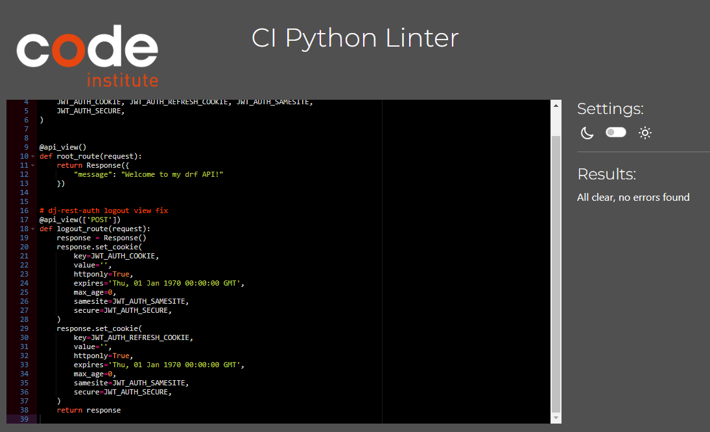
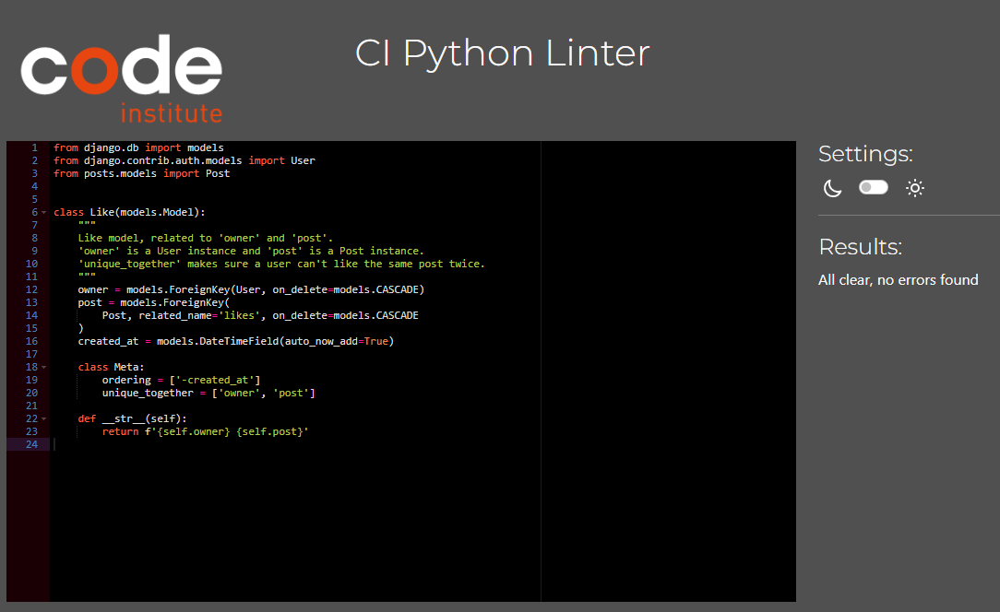
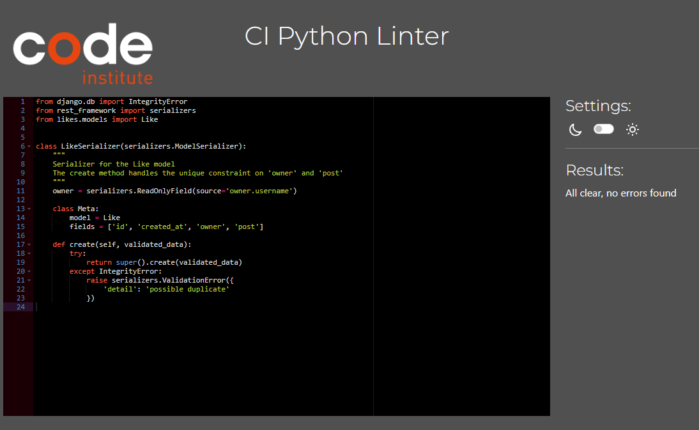
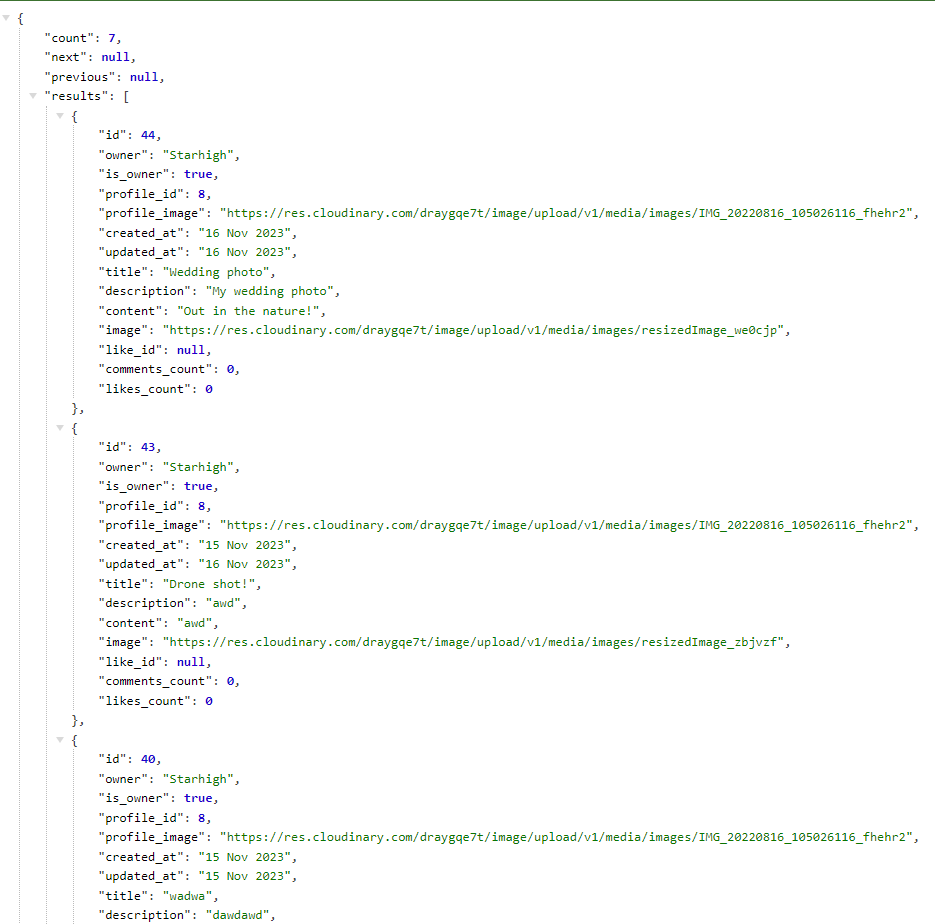

# React project (Project Portfolio 5, Advanced FrontEnd) for Code Institute.

## General information

Link to the application: [Click Here!](https://pro5-aeecc7322fbc.herokuapp.com/)

---
## Table of Contents

 - ## [General Information](#general-information)

 - ## [Table of Contents](#table-of-contents-1)

 - ## [User Stories](#user-stories-1)

 - ## [Database](#database-1)
    
- ## [Testing](#testing-1)
    - ## [Code Validation](#code-validation-1)
    - ## [Manual Testing](#manual-testing-1)
    - ## [Future improvements](#Future-improvements-1)
- ## [Bugs](#Bugs-1)

- ## [Libraries and Software](#Libraries-and-Software-1)

---
# User Stories/Tasks

| **EPIC** | **ID #** | **User Story** | **Github project** |
|-------------|------------|---------------------|---------------------|

---

## Database
The project uses the PostgreSQL relational Database for storing Data. This project was set up using [ElephantSQL](https://elephantsql.com/).

### Models

#### User Model
- User Model is a part of the Django Rest Framework dj-rest-auth library. It contains basic information about authenticated users such as Username & Password.

#### Profile Model
- Profile model is created for users to add or change the details on their profile page such as, Name, Bio & Profile Image.

| **Name** | **Field Type** | **Validation** |
|-------------|------------|---------------------|
| owner | OneToOneField | User, on_delete=models.CASCADE | 
| created_at | DateTimeField | auto_now_add=True |
| updated_at | DateTimeField | auto_now_add=True |
| name | CharField | max_length=255, blank=True |
| content | TextField | blank=True |
| image | ImageField | upload_to="images/", default="../default_profile" |

- Owner has a OneToOne relationship with the User model. If the User object is deleted also deletes the object that has the Foreign Key.
- Created_at is a DateTimeField that automatically sets the time and date when created.
- Updated_at is a DateTimeField that automatically sets the time and date when updated.
- Name is a Charfield with an allowed max length of 255. This field is allowed to be empty.
- Content is a Textfield that is allowed to be empty.
- Image contains the profile image, and if none is chosen by the user, defaults to the default profile picture.

|  |  |  |
|  |  |  |
|  |  |  |
|  |  |  |
|  |  |  |

--- 
## Testing

### Code Validation

### Python
I have separated the validation files by each app to make it easier to find.

All python files has been validated and shows no errors.

The env.py file has too long lines, but since those are links, I have accepted those as being too long.

### Comments

apps.py

models.py

serializers.py

urls.py

views.py

### drf_api

permissions.py

serializers.py

settings.py

urls.py

views.py

### followers

apps.py

models.py

serializers.py

urls.py

views.py

### information

apps.py

models.py

serializers.py

urls.py

views.py

### likes

apps.py

models.py

serializers.py

urls.py

views.py

### posts

apps.py

models.py

serializers.py

urls.py

views.py

### profiles

apps.py

models.py

serializers.py

urls.py

views.py

### root

settings.py

env.py

### tickets

apps.py

models.py

serializers.py

urls.py

views.py

---

## Manual Testing
The manual testing is done by going to the deployed site, and adding "/api/" then the page you want to see data from. 

For example, to view all profiles in a list:
    - https://pro5-aeecc7322fbc.herokuapp.com/api/profiles/

1. Profiles

| **Feature** | **Action** | **Expected result** | **Pass/Fail** |
|-------------|------------|---------------------|-------------------|
| View all profiles | Add "/profiles" to the URL. | All profiles are displayed in a list. | :heavy_check_mark: |
| View a specific profile | Add "/profiles/id" to the URL. | All profiles are displayed in a list. | :heavy_check_mark: |
| Change Username | Add "/profiles/id" to the URL. | Owner field has been updated with the new Username. | :heavy_check_mark: |
| Change Bio(content) | Add "/profiles/id" to the URL. | Content field has been updated with the new Content. | :heavy_check_mark: |
| Change Name | Add "/profiles/id" to the URL. | Name field has been updated with the new Name. | :heavy_check_mark: |
| Remove Name | Add "/profiles/id" to the URL. | Name field has been updated and contains no Name. | :heavy_check_mark: |
| Change profile image | Add "/profiles/id" to the URL. | Image link has been updated with the new image link. | :heavy_check_mark: |
| Follow a profile | Add "/profiles/id" to the URL. | Following_Count has been increased with 1. | :heavy_check_mark: |
| Unfollow a profile | Add "/profiles/id" to the URL. | Following_Count has been decreased with 1. | :heavy_check_mark: |
| Create a post | Add "/profiles/id" to the URL. | Posts_count has been increased with 1. | :heavy_check_mark: |
| Delete a post | Add "/profiles/id" to the URL. | Posts_count has been decreased with 1. | :heavy_check_mark: |
| View an profile that is not yours | Add "/profiles/id" to the URL. | is_owner field is False. | :heavy_check_mark: |
| View a profile that is yours as signed In. | Add "/profiles/id" to the URL. | is_owner field is True. | :heavy_check_mark: |
| View a profile that is yours as signed Out. | Add "/profiles/id" to the URL. | is_owner field is False. | :heavy_check_mark: |

Profiles list

Profile ID

2. Posts

| **Feature** | **Action** | **Expected result** | **Pass/Fail** |
|-------------|------------|---------------------|-------------------|
| View all posts | Add "/posts" to the URL. | All posts are displayed in a list. | :heavy_check_mark: |
| View a specific post | Add "/posts/ID" to the URL. | The specific post is displayed. | :heavy_check_mark: |
| View a specific post you own | Add "/posts/ID" to the URL. | Is_owner is set to True. | :heavy_check_mark: |
| View a specific post you don't own | Add "/posts/ID" to the URL. | Is_owner is set to False. | :heavy_check_mark: |
| Change title of a post | Add "/posts/ID" to the URL. | The Title is updated. | :heavy_check_mark: |
| Change description of a post | Add "/posts/ID" to the URL. | The description is updated. | :heavy_check_mark: |
| Change content of a post | Add "/posts/ID" to the URL. | The Content is updated. | :heavy_check_mark: |
| Change image of a post | Add "/posts/ID" to the URL. | The image url is updated. | :heavy_check_mark: |
| Like a post | Add "/posts/ID" to the URL. | Likes_count is increased by 1. | :heavy_check_mark: |
| Like a post | Add "/posts/ID" to the URL. | Like_id is set. | :heavy_check_mark: |
| Unlike a post | Add "/posts/ID" to the URL. | Like_id is set to Null. | :heavy_check_mark: |
| Unlike a post | Add "/posts/ID" to the URL. | Likes_count is decreased by 1. | :heavy_check_mark: |
| Comment on a post | Add "/posts/ID" to the URL. | Comments_count is increased by 1. | :heavy_check_mark: |
| Delete comment on a post | Add "/posts/ID" to the URL. | Comments_count is decreased by 1. | :heavy_check_mark: |
| Update a post | Add "/posts/ID" to the URL. | Updated_at updates to todays date. | :heavy_check_mark: |
| Delete a post | Add "/posts/ID" to the URL. | "Detail not found" is displayed and the post is gone. | :heavy_check_mark: |

Post list

Post ID

3. Comments

| **Feature** | **Action** | **Expected result** | **Pass/Fail** |
|-------------|------------|---------------------|-------------------|
| View all Comments | Add "/comments" to the URL. | All Comments are displayed in a list. | :heavy_check_mark: |
| View a specific Comment | Add "/comments/ID" to the URL. | The specific comment is displayed. | :heavy_check_mark: |
| View a specific Comment that you created | Add "/comments/ID" to the URL. | Is_owner is set to True | :heavy_check_mark: |
| View a specific Comment that you did not create | Add "/comments/ID" to the URL. | Is_owner is set to False | :heavy_check_mark: |
| View a profile ID of creator of the post | Add "/comments/ID" to the URL. | Profile_ID is displaying the Profile ID of the creator of the post | :heavy_check_mark: |
| Update a specific Comment | Add "/comments/ID" to the URL. | Updated_at is updated. | :heavy_check_mark: |
| Update a specific Comments content | Add "/comments/ID" to the URL. | The content is updated. | :heavy_check_mark: |
| Update a specific Comments content | Add "/comments/ID" to the URL. | The content is updated. | :heavy_check_mark: |
| Delete a comment | Add "/comments/ID" to the URL. | "Detail not found" is displayed and the comment is gone. | :heavy_check_mark: |

Comment list

Comment ID

4. Information

| **Feature** | **Action** | **Expected result** | **Pass/Fail** |
|-------------|------------|---------------------|-------------------|
| View all Information objects | Add "/information" to the URL. | All Information objects are displayed in a list. | :heavy_check_mark: |
| View a specific Information object | Add "/information/ID" to the URL. | The specific object is displayed. | :heavy_check_mark: |
| View a specific Information object that you created | Add "/information/ID" to the URL. | Is_owner is set to True | :heavy_check_mark: |
| View a specific Information object that you did not create | Add "/information/ID" to the URL. | Is_owner is set to False | :heavy_check_mark: |
| Update an information object | Add "/comments/ID" to the URL. | Updated_at is updated with todays date. | :heavy_check_mark: |
| Update the start_date | Add "/comments/ID" to the URL. | Start_date is updated with the new date. | :heavy_check_mark: |
| Update the end_date | Add "/comments/ID" to the URL. | End_date is updated with the new date. | :heavy_check_mark: |
| Update the text | Add "/comments/ID" to the URL. | The Text is updated with the new text. | :heavy_check_mark: |
| Delete a information object | Add "/comments/ID" to the URL. | "Detail not found" is displayed and the information object is gone. | :heavy_check_mark: |

Information list

Information ID

5. Tickets/Contactform
- For tickets I am only able to display a list of the tickets made by the user I am currently signed in as.

| **Feature** | **Action** | **Expected result** | **Pass/Fail** |
|-------------|------------|---------------------|-------------------|
| View all Tickets in a list | Add "/tickets" to the URL. | All Tickets made by the signed in user are displayed in a list. | :heavy_check_mark: |
| View a specific Tickets | Add "/tickets" to the URL. | The specific Ticket is displayed | :heavy_check_mark: |
| View a specific Ticket that you created | Add "/tickets/ID" to the URL. | Is_owner is set to True | :heavy_check_mark: |
| Update a Ticket | Add "/tickets/ID" to the URL. | Updated_on is updated with todays date. | :heavy_check_mark: |
| Update the Subject | Add "/tickets/ID" to the URL. | The Subject is updated with the new text. | :heavy_check_mark: |
| Update the Message | Add "/tickets/ID" to the URL. | The Message is updated with the new text. | :heavy_check_mark: |
| Delete a Ticket | Add "/tickets/ID" to the URL. | "Detail not found" is displayed and the Ticket is gone. | :heavy_check_mark: |

Ticket list

Ticket ID

---
## Bugs

| **Bug** | **Solution** |
|-------------|------------|
| When testing, I could not display all tickets from all users in a list, but only the user I was signed in as. | No errors or problem caused by this. Everything works as expected on the website and all tickets are saved to each user and to the server. |

---

### Modules/ Packages used:
Most important packages:
- django: Python web framework used to develop the site.
- psycopg2: PostgreSQL database for the Python programming lanugage.
- dj3-cloudinary-storage: Integrates Cloudinary with Django Storage API.
- django-allauth: Integrates user authentication aswell as 3rd party account authientication such as facebook and other social accounts.
- Gunicorn: Gunicorn is a pure-Python HTTP server for WSGI applications.

All packages

---
## Deployment

The deployment guidelines can be found in the [Deployment Readme](https://github.com/gStarhigh/pro5/blob/main/Deployment_README.md).
