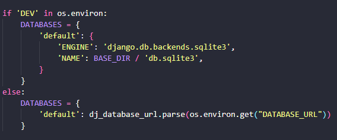

# React project (Project Portfolio 5, Advanced FrontEnd) for Code Institute.

## General information
This Readme goes through the steps of setting up your workspace and deploying your project to both GitHub and Heroku.

Link to the application: [Click Here!](https://pro5-aeecc7322fbc.herokuapp.com/)

Link to the Backend README: [Click Here!](https://github.com/gStarhigh/pro5/blob/main/Backend_README.md)

Link to the Frontend README: [Click Here!](https://github.com/gStarhigh/pro5/blob/main/README.md)

## Table of Contents

 - ## [General Information](#general-information)

 - ## [Table of Contents](#table-of-contents-1)

- ## [Deployment](#Deployment-1)
    - ## [Creating the Workspace](#creating-the-workspace-1)
    - ## [Deploying the project](#deploying-the-project-1)

- ## [GitHub Pages](#github-pages-1)

## Deployment

### Creating the workspace
I have created both my FrontEnd and the BackEnd in the same workspace. All instructions that follow are for a combined workspace using GITPOD. If you have your Backend in a separate workspace or use CodeAnywhere, this is not the correct way to continue and some thing might differ.

1. Navigate to [This link](https://github.com/Code-Institute-Org/gitpod-full-template) , and click "Use this template".
2. Click Create a new repository.
3. Choose a name for your repository and click "Create repository"
4. Then you can open it up in GitPod by clicking the Green "Gitpod" button.

#### Create the Backend
1. When your IDE has finished installing everything, type "pip3 install 'django<4'" to install the same version of django as I used. If you want the latest, just type "pip install django"
2. Create your project by typing in the termial: "django-admin startproject *yourprojectsname* ."
Don't forget the dot at the end.
3. Install Cloudinary by typing in the termial: "pip install django-cloudinary-storage".
4. Install Pillow by typing in the terminal: "pip install Pillow". Notice the capital P.
5. Add cloudinary to the Installed Apps. Notice the order of where they are inserted:
    

    
Installed apps

    
    

6. Navigate to [Cloudinary](https://cloudinary.com/) and create an account.
7. In the account details section, there is an API Envrionment variable. Copy that URL.
8. Create a filed called "env.py" in the root of your directory.
9. At the top of the env.py file write: "import os"
10. Add this line to your env.py file: os.environ['CLOUDINARY_URL'] = "Paste the URL here".
    Make sure the url starts with "cloudinary://" and not "CLOUDINARY_URL=cloudinary://".
11. Go to the settings.py file and find the SECRET_KEY, and copy it.
12. Go back to the env.py file and add this line: os.environ['SECRET_KEY'] = 'PAST IN YOUR SECRET KEY HERE'
13. Go back to your settings.py file and add these lines at the top of the file:
    

    
Settings Imports

    
    

14. Add these lines to the settings file:
    

    
Cloudinary

    
    

    

    
Secret Key

    
    

    

    
Media

    
    

15. Now the basic settings are in place, and since we have moved the SECRET_KEY to the env.py file before comitting and pushing to GitHub, it is safe and we can now add, commit, and push our first time to GitHub.
    - NOTE: It's important that you have not comitted anything while the Secret Key was in settings.py as this will then be open for everyone to find in your GitHub account. If you have done this, change the secret key variable in your env.py file, and commit and push again. Now the secret key is protected.

#### Creating the FrontEnd inside the Backend workspace

. Open the workspace for your Backend project.

2. Open the terminal window and create a new folder called frontend in the root directory with this command:
    - "mkdir frontend"

3. Change directory to be inside the frontend folder with the following command:
    - "cd frontend"

4. From inside the frontend directory, run the following command to create a new React app and install all the working dependencies:
    - "npx create-react-app . --template git+https://github.com/Code-Institute-Org/cra-template-moments.git --use-npm"

5. Enter "y" to confirm.

6. When everything has completed, Enter the following command to remove the .git folder, .gitignore file and README.md from the frontend folder as these already exist within the root directory of your Backend project.
    - NOTE: Make sure you are in the frontend terminal when running this command:
    - "rm -rf .git .gitignore README.md"

7. Inside the FrontEnd directory, run the following command to make sure it works:
    - "npm start"

8. Open the browser to see the React logo so it works as expected.

9. Stop the application with "CTRL-C" in the terminal on windows, and "CMD-C" on a Mac.
10. Move back to the root of your directory by "cd ..".(My personal way is to have one terminal open for the backend and one for the frontend side by side. Simplifies the process. Please do this in the future as you will need this to be able to start both the backend and the front end in different terminals)

11. Add, commit, and push your changes to GitHub every so often.

12. Open your env.py file
13. Add a new key with your BACKEND local link like this:
    - os.environ['ALLOWED_HOST'] = '8000-gstarhigh-pro5-SOMETHINGELSEHERE.gitpod.io'
14. Add a new key with your FRONTEND local link like this:
    - os.environ['CLIENT_ORIGIN'] = 'https://8080-gstarhigh-pro5-SOMETHINGELSEHERE.gitpod.io'
    Note the differences with the "/" in the two above.
It should now look like this:
    

    
env.py

    
    

Now we need to navigate back to the Backend, to the settings.py file and do the following:

15. Add the ALLOWED_HOSTS:
    

    
Allowed Hosts

    
    

16. CORS should look like this:
    

    
CORS

    
    

17. Navigate to the package.json file in your FRONTEND directory and add the line called "proxy" at the very bottom as shown:
    

    
Proxy

    
    
    

#### Creating the Heroku app and Elephant SQL database.

1. Install Gunicorn:
    - pip3 install 'django<4' gunicorn
2. Install Supporting libraries:
    - pip3 install dj_database_url==0.5.0 psycopg2
3. Create requirements.txt file:
    - pip3 freeze --local > requirements.txt
    Make sure you update your requirements.txt file everytime you install something new.

4. Log in, or create an account at [ElephantSQL](https://elephantsql.com/).
5. Click "Create new instance".
6. Choose a name for your project.
7. Choose your plan (Choose Tiny Turtle for the free option).
8. Tags are optional to fill out, then press "Select region".
9. Choose the region closest to you.
10. Return to the dashboard and choose your newly created project.
11. Under "Details", find the URL for your database and copy it. The link starts with "postgres://...." (We will use this soon)

Back to creating the Heroku APP.

12.  Login to Heroku and click "New" -> "Create new app" to start a new project.
13. Login to Heroku and click "New" -> "Create new app" to start a new project.
14.  Choose an "app name" and "Region" - Then press "Create app".
15. Remove any installed ADD-ONS created by Heroku as we will not need them and they cost money. Your overview should look like this:
    

    
Overview

    
    

Adding Config Vars

16. Click on Settings tab, and choose "Reveal Config Vars" and add the following:
17. As key type: DATABASE_URL
    - As Value: "The link you copied earlier from ElephantSQL".
19. As key type: SECRET_KEY
    - As Value: The SECRET_KEY link in your env.py file.
20. As key type: CLOUDINARY_URL
    - As Value: Your cloudinary link in your env.py file.
21. As Key type: DISABLE_COLLECTSTATIC
    - As Value: 1

    When we are finished and everything is complete, your Config Vars should look like this: 
    

    
Config Vars

    
    

22. To be able to use the elephantSQL database on you deployed project, and the local sqlite3 database on your local evironment, add the following to your settings.py file:
    

    
Database Dev

    
    

Then add the following line to the env.py file:
    - os.environ['DEV'] = "1"
If you always want to use the ElephantSQL database, you dont have to add that to the env.py file.

#### Deploying the project

1. Navigate to the root of your project in the terminal and type this command:
    - "pip3 install whitenoise==6.4.0"

2. Update your requirements file:
    - "pip3 freeze > requirements.txt"

3. Create a new folder called staticfiles in the root of your project with this command:
    - "mkdir staticfiles"

4. Move the cloudinary_storage in settings.py file, below the django.contrib.staticfiles:
    

    
Database Dev

    
    

5. In the MIDDLEWARE list in settings.py, add WhiteNoice BELOW the SecurityMiddleware and above SessionMiddleware:
    - Add this line:  'whitenoise.middleware.WhiteNoiseMiddleware',
    

    
MIDDLEWARE

    
    

6. In the TEMPLATES list in settings.py, add the following code:
    -  os.path.join(BASE_DIR, 'staticfiles', 'build')
    

    
TEMPLATES

    
    

7. In the staticfiles section, add STATIC_ROOT and WHITENOICE_ROOT
    -  STATIC_ROOT = BASE_DIR / 'staticfiles'
    -  WHITENOISE_ROOT = BASE_DIR / 'staticfiles' / 'build'
    

    
Static Files

    
    

Adding the root_view

8. Navigate to the urls.py file in your BackEnd application:
    - Remove the "root_route" from .views imports.
    - Add TemplateView import.
    

    
Urls

    
    

9. In the urlpatterns list, remove the root_route code and replace it with Templateview pointing to the index.html file:
    - Add this code: "path('', TemplateView.as_view(template_name='index.html')),"

10. At the bottom of the file, add the 404 handler:
    -  handler404 = TemplateView.as_view(template_name='index.html')

11. Add "api/" to the beginning of all urls, excluding the path for Home page and admin panel.
    - "api/"

Your file should look like this now(with your own links):
    

    
URLPatterns

    
    

axiosDefaults.js File.

12. If you have not created an axios.defaults.js file, you need to do that now.
    - In your Frontend directory, create a folder called "api", and within that folder, create the file "axiosDefaults.js".

13. Make sure your axiosDefaults.js file looks like this:
    

    
Axios Defaults

    
    

14. Create a filed in the root of your directory called:
    - "Procfile"
        - Notice the capital P.
    - Inside this file, add these 2 commands:
        - "release: python manage.py makemigrations && python manage.py migrate"
        - "web: gunicorn drf_api.wsgi"

15. In settings.py Add corsheaders, above your installed apps in the installed apps list:
    - "'corsheaders',"

16. Add corsheaders middleware to the TOP of the MIDDLEWARE list:
    - "'corsheaders.middleware.CorsMiddleware',"

Compiling staticfiles.

17. In the root directory terminal type this(if you don't already have a staticfiles folder in your root of your project):
    - "mkdir staticfiles"
    Then:
    - "python3 manage.py collectstatic"

18. Navigate to the frontEnd in your terminal and type:
    - npm run build && mv build ../staticfiles/.

Important: Everytime you do changes to your code, you will need to rerun this command in the frontEnd directory in the terminal:
    - "npm run build && rm -rf ../staticfiles/build && mv build ../staticfiles/."

Runtime

19. In the root of your directory create a file called:
    - "runtime.txt"

20. Within the runtime.txt file, add this:
    - "python-3.9.16"

21. Make sure all servers are terminated, use the command:
    - "CTRL-C" or "CMD-C".

We can now deploy the project for the first time to Heroku.
- Make sure everything is committed and pushed to github!

22. Open Heroku and navigate to the Deploy tab.

23. Click on "Connect to GitHub"

24. Search for your repo and click "Connect"

25. Click in "Enable automatic deployes(optional)"

26. Use the "Manual deploy" and click "Deploy Branch"

When the app is deployed, copy the url to the deployed app and go back to the config Vars section.

27. Here we need to change 2 Keys and values:
    1. KEY: "ALLOWED_HOST"  VALUE: "post in the deployed URL"
    - Make Sure to remove "https://" at the beginning and the trailing "/" at the end of your URL.
    2. KEY: "CLIENT_ORIGIN" VALUE: "post in the deployed URL"
    - KEEP the "https://" at the beginning, but remove the trailing "/".

28. Now you can redeploy your app from the dashboard if needed.

Good luck!

---
## Github Pages
- This project was developed using Gitpod which I used to commit and push to GitHub using the terminal in GitPod.(Note that this project was deployed to Heroku and that those steps also must be followed.)
### Here are the steps to deploy a website to GitHub Pages from its GitHub repository:

- Log in to GitHub and locate the GitHub Repository.
- At the top of the Repository, locate the Settings button on the menu.
- Under Source, click the dropdown called None and select Main Branch.
- The page will refresh automatically and generate a link to your website.
### Forking the GitHub Repository
- By forking the GitHub Repository we make a copy of the original repository on our GitHub account to view and/or make changes without affecting the original repository by using the following steps...

- Log in to GitHub and locate the GitHub Repository.
- At the top of the Repository (not top of page) just above the "Settings" Button on the menu, locate the "Fork" Button.
- You should now have a copy of the original repository in your GitHub account.
### Making a Local Clone
- Log in to GitHub and locate the GitHub Repository
- Under the repository name, click "Clone or download".
- To clone the repository using HTTPS, under "Clone with HTTPS", copy the link.
- Open Git Bash
- Change the current working directory to the location where you want the cloned directory to be made.
- Type git clone, and then paste the URL you copied in Step 3. $ git clone https://github.com/YOUR-USERNAME/YOUR-REPOSITORY
- Press Enter. Your local clone will be created.