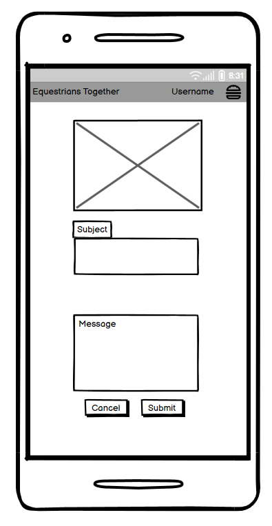
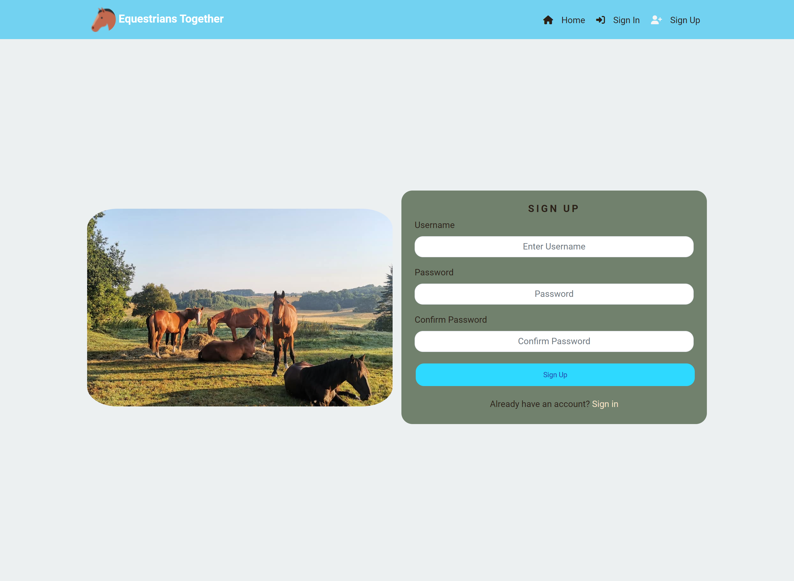
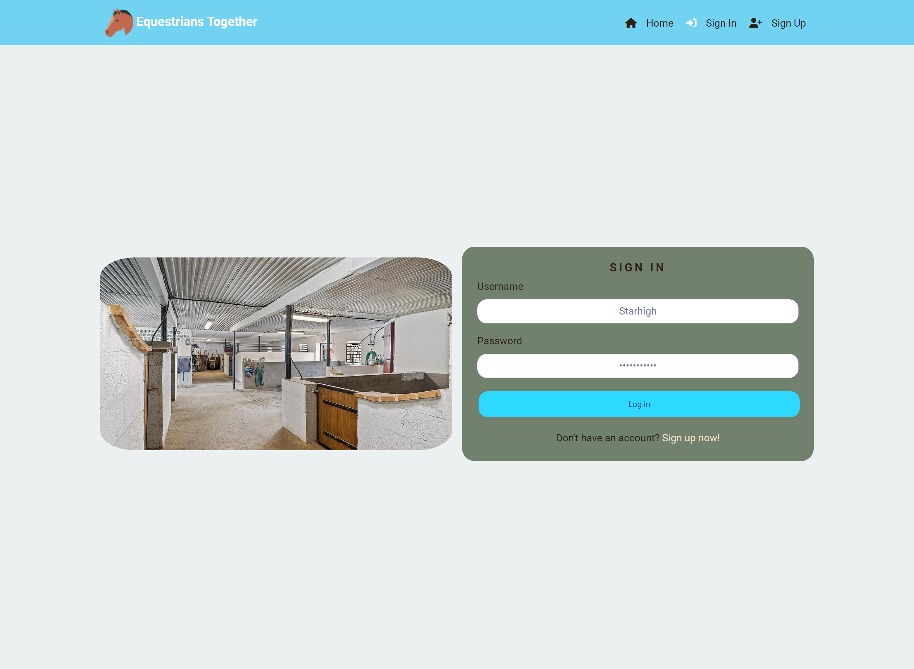

# React project (Project Portfolio 5, Advanced FrontEnd) for Code Institute.

## General information
Equestrians Together is an online page for equestrians. The original idea, and the idea behind the site, is that those who have their horse in our (IRL) stable, can share images and information with one another to ease their communication and easier share their experiences with one another.

This website was created with a "mobile view first" idea, which means that I believe that the users of this site will to the most part use it through a mobile device.

The website has full CRUD functionality, which means that users can:

- Create a post, comment, information post, or contact form.
- View a post, comment, information post, or contact form.
- Edit a post, comment, information post, or contact form.
- Delete a post, comment, information post, or contact form.

This project was created within a deadline and I have alot of ideas I want to implement going forward, but due to a short timetable some features had to be left out. You can read more about this [here](#Future-improvements-1).

Link to the application: [Click Here!](https://pro5-aeecc7322fbc.herokuapp.com/)

Link to the Backend README: [Click Here!](https://github.com/gStarhigh/pro5/blob/main/Backend_README.md)

Image of the finished website - Mobile

Image of the finished website - Desktop

---
## Table of Contents

 - ## [General Information](#general-information)

 - ## [Table of Contents](#table-of-contents-1)

 - ## [UX](#UX-1)

 - ## [Project Goals](#project-goals-1)

 - ## [User Stories](#user-stories-1)

 - ## [Flowchart](#Flowchart-1)

 - ## [General features](#general-features-1)
    
- ## [Testing](#testing-1)
    - ## [Code Validation](#code-validation-1)
    - ## [Testing User Stories](#testing-user-stories-1)
    - ## [Manual Testing](#manual-testing-1)
    - ## [Future improvements](#Future-improvements-1)
- ## [Bugs](#Bugs-1)

- ## [Libraries and Software](#Libraries-and-Software-1)

- ## [Final Result](#final-result-1)

- ## [Deployment](#deployment-1)

- ## [Github Pages](#github-pages-1)

- ## [Credits](#credits-1)
---
## UX

### Colors and Fonts used:

#### Font
The Font I chose is from GoogleFonts and are free to use. I chose the font called "Roboto" with sans-serif as a fallback font. 
Roboto is clean and easy to read. 

#### Color
The main colors for the site are:
- Text color: #2B2118 or #fff.
- Navbar background color: rgb(114, 210, 241).
- Button colors: #968E85 or #2142b2.
- Main Background color for the site: #ECF0F1.

## Project Goals
The project goal was to create a responsive website using the Django Framework API along with React to provide a modern website with real life updates using reusable components throughout the project. A user should be able to post information and images to other users to take enjoy and take part of. 

---
# User Stories
All acceptance criteria can be viewed in [GITHUB](https://github.com/users/gStarhigh/projects/5/views/1?visibleFields=%5B%22Title%22%2C%22Assignees%22%2C%22Status%22%2C%22Milestone%22%2C%22Labels%22%5D) on each Issue.

I used milestones for each part of the project to map out everything that needed to be done for each functionality to work. Everything was planned and setup using GitHub.

- The two Milestones/tasks called "Hay usage" and "Invoices" were not implemented.

Image Milestones

The Kanban board was a great help in keeping track of what I had done and what needed to be done in this project. Some were added throughout the project to simplify the planning and adding additional features.

Image of the Kanban board

| **EPIC** | **ID #** | **User Story** | **Label** | **Github project** |
|-------------|------------|---------------------|---------------------|---------------------|
| **User Authorization** | 
|  | 8 | As a Site User I can easily see my login status so that I know if I'm logged in to the site. | Must Have | [Link](https://github.com/users/gStarhigh/projects/5/views/1?visibleFields=%5B%22Title%22%2C%22Assignees%22%2C%22Status%22%2C%22Milestone%22%2C%22Labels%22%5D&filterQuery=milestone%3A%22User+Authorization%22&pane=issue&itemId=41214544) |
|  | 9 | As a Site User I can register for an account so that I can create, likem comment and delete posts. | Must Have | [Link](https://github.com/users/gStarhigh/projects/5/views/1?visibleFields=%5B%22Title%22%2C%22Assignees%22%2C%22Status%22%2C%22Milestone%22%2C%22Labels%22%5D&filterQuery=milestone%3A%22User+Authorization%22&pane=issue&itemId=41214899) |
| **Navigation** | 
|  | 10 | As a User I can view the Navbar from every page to make navigation easy. | Must Have | [Link](https://github.com/users/gStarhigh/projects/5/views/1?visibleFields=%5B%22Title%22%2C%22Assignees%22%2C%22Status%22%2C%22Milestone%22%2C%22Labels%22%5D&filterQuery=milestone%3ANavigation&pane=issue&itemId=41220590) |
 | **Posts** | 
|  | 12 | As a logged in User I can create a POST so others can view, comment and like my post. | Must Have | [Link](https://github.com/users/gStarhigh/projects/5/views/1?visibleFields=%5B%22Title%22%2C%22Assignees%22%2C%22Status%22%2C%22Milestone%22%2C%22Labels%22%5D&filterQuery=milestone%3APosts&pane=issue&itemId=41220968) |
 |  | 13 | As a logged in User I can Like a POST so others can see that the post has been liked. | Must Have | [Link](https://github.com/users/gStarhigh/projects/5/views/1?visibleFields=%5B%22Title%22%2C%22Assignees%22%2C%22Status%22%2C%22Milestone%22%2C%22Labels%22%5D&filterQuery=milestone%3APosts&pane=issue&itemId=41221126) |
 |  | 14 | As a logged in User I can comment on a POST so others can see that the post has at least one comment. | Must Have | [Link](https://github.com/users/gStarhigh/projects/5/views/1?visibleFields=%5B%22Title%22%2C%22Assignees%22%2C%22Status%22%2C%22Milestone%22%2C%22Labels%22%5D&filterQuery=milestone%3APosts&pane=issue&itemId=41221232) |
 |  | 16 | As a user I can search for a Post to easier find what I am looking for. | Must Have | [Link](https://github.com/users/gStarhigh/projects/5/views/1?visibleFields=%5B%22Title%22%2C%22Assignees%22%2C%22Status%22%2C%22Milestone%22%2C%22Labels%22%5D&filterQuery=milestone%3APosts&pane=issue&itemId=42254899) |
 |  | 17 | As a user I can keep scrolling down the page and new posts will be loaded without me having to press a button to load more posts. | Must Have | [Link](https://github.com/users/gStarhigh/projects/5/views/1?visibleFields=%5B%22Title%22%2C%22Assignees%22%2C%22Status%22%2C%22Milestone%22%2C%22Labels%22%5D&filterQuery=milestone%3APosts&pane=issue&itemId=42959058) |
 |  | 18 | As a post Owner I can edit my own post to change anything I want about my existing post. | Must Have | [Link](https://github.com/users/gStarhigh/projects/5/views/1?visibleFields=%5B%22Title%22%2C%22Assignees%22%2C%22Status%22%2C%22Milestone%22%2C%22Labels%22%5D&filterQuery=milestone%3APosts&pane=issue&itemId=42961068) |
  | **Profiles** | 
|  | 19 | As a user I can see a list of the most followed profiles on the site to easy see how the most popular profiles are. | Must Have | [Link](https://github.com/users/gStarhigh/projects/5/views/1?visibleFields=%5B%22Title%22%2C%22Assignees%22%2C%22Status%22%2C%22Milestone%22%2C%22Labels%22%5D&filterQuery=milestone%3AProfiles&pane=issue&itemId=43308350) |
 |  | 20 | As a logged in user I can follow whatever profile I want to keep up with their posts. | Must Have | [Link](https://github.com/users/gStarhigh/projects/5/views/1?visibleFields=%5B%22Title%22%2C%22Assignees%22%2C%22Status%22%2C%22Milestone%22%2C%22Labels%22%5D&filterQuery=milestone%3AProfiles&pane=issue&itemId=43308602) |
  |  | 21 | As I user I can see a users profile page to find more information about the user and their interaction on the site. | Must Have | [Link](https://github.com/users/gStarhigh/projects/5/views/1?visibleFields=%5B%22Title%22%2C%22Assignees%22%2C%22Status%22%2C%22Milestone%22%2C%22Labels%22%5D&filterQuery=milestone%3AProfiles&pane=issue&itemId=43318646) |
  |  | 22 | As a user I can unfollow a profile that I no longer want to follow. | Must Have | [Link](https://github.com/users/gStarhigh/projects/5/views/1?visibleFields=%5B%22Title%22%2C%22Assignees%22%2C%22Status%22%2C%22Milestone%22%2C%22Labels%22%5D&filterQuery=milestone%3AProfiles&pane=issue&itemId=43329403) |
  | **Important weekly information** | 
|  | 23 | As a User I can add information with a start and end date so other user on the site can take part of the information. | Should Have | [Link](https://github.com/users/gStarhigh/projects/5/views/1?visibleFields=%5B%22Title%22%2C%22Assignees%22%2C%22Status%22%2C%22Milestone%22%2C%22Labels%22%5D&filterQuery=milestone%3A%22Important+weekly+information%22&pane=issue&itemId=43662957) |
|  | 24 | As a User I can edit or delete information that I have posted and own. | Should Have | [Link](https://github.com/users/gStarhigh/projects/5/views/1?visibleFields=%5B%22Title%22%2C%22Assignees%22%2C%22Status%22%2C%22Milestone%22%2C%22Labels%22%5D&filterQuery=milestone%3A%22Important+weekly+information%22&pane=issue&itemId=43662985) |
|  | 25 | As a logged in User I can see my own and others important weekly information. | Should Have | [Link](https://github.com/users/gStarhigh/projects/5/views/1?visibleFields=%5B%22Title%22%2C%22Assignees%22%2C%22Status%22%2C%22Milestone%22%2C%22Labels%22%5D&filterQuery=milestone%3A%22Important+weekly+information%22&pane=issue&itemId=43663062) |
  | **Notifications** | 
|  | 26 | As a User I get notifications on the site whenever I perform an action so I know that my action was successful. | Must Have | [Link](https://github.com/users/gStarhigh/projects/5/views/1?visibleFields=%5B%22Title%22%2C%22Assignees%22%2C%22Status%22%2C%22Milestone%22%2C%22Labels%22%5D&filterQuery=milestone%3ANotifications&pane=issue&itemId=43808952) |
  | **Contact** | 
|  | 11 | As a User I can contact the page owner through the contact page to ask any question I might have. | Must Have | [Link](https://github.com/users/gStarhigh/projects/5/views/1?visibleFields=%5B%22Title%22%2C%22Assignees%22%2C%22Status%22%2C%22Milestone%22%2C%22Labels%22%5D&filterQuery=milestone%3AContact&pane=issue&itemId=41220713) |

The model user stories(or tasks), can be viewed in the Backend README.
---
## Flowchart

### Structure
The structure of the website is divided between authenticated users and not authenticated.
- The Register page gives the user the ability to create an account.
- The Login page gives the user to login using an existing username and password.
- The Home page is visible for all users, however some functionality is only available to authenticated users:
- Authenticated:
    - Important weekly information on the homepage is displayed, if any exist.
    - Important weekly information posts disappears after end date has passed.
    - The subscribe/unsubscribe buttons on the popular profiles are visible.
    - Sign up in the navbar is hidden.
    - Sign in in the navbar is hidden.
    - Contact in the navbar is visible.
    - Profile name and avatar in navbar is visible.
    - Sign out in the navbar is visible.
    - The Post navigation buttons (All, Liked, Feed) are visible. 
    - Post navigation button All - Lets you view all posts.
    - Post navigation button Liked - Lets you view all posts you have liked.
    - Post navigation button All - Lets you view all posts from those whom you have subscribed to.
    - You can like a post directly from the home page.

- Not Authenticated:
    - Important weekly information is hidden.
    - The subscribe/unsubscribe buttons are hidden.
    - Contact page in the navbar is hidden.
    - Profile name and avatar in the navbar is hidden.
    - Sign out in the navbar is hidden.
    - Sign up in the navbar is visible.
    - Sign in in the navbar is visible.
    - A tooltip is displayed when trying to like a post saying that you need to login to like a post.
    - The Post navigation buttons (All, Liked, Feed) are hidden.

- Create a post is only available to authenticated users.
- Edit or delete a post is only available to the creator of the post.
- Create information is only available to authenticated users.
- Edit or delete information is only available to the creator of the information.
- Contact form is only available to authenticated users.
- Edit or delete of the contact ticket, is only available to the creator of the ticket.
- Comment on a post is only available to authenticated users.
- Edit or delete of a comment on a post is only available to the creater of the comment.

#### Here is an image of the structure I used for this project.
The flowchart was made using [Lucidchart](https://lucid.co/).

Structure

#### Wireframes
The Wireframes should not be considered finished result of the website, but as a tool I used to plan and visualize the project as I worked on it. The wireframes were only made for mobile devices since React Bootstrap is a mobile first framework.

All wireframes were created using [Balsamiq](https://balsamiq.com/).

Homepage

Signup page

Login page

Create post page

Create information page

Contact page

Profile page

---
## General features

#### Header and Navigation
The Navbar is visible throughout the entire application, however what you see differs depending if you are authenticated or not. The Home button, and the name and image of the application is the only ones that are the same regardless of your login status.

Navbar not expanded - Mobile

Navbar not authenticated - Mobile expanded

Navbar not authenticated - Desktop

Navbar authenticated - Mobile expanded

Navbar authenticated - Desktop

#### Account Creation
The Sign Up navigation button is only visible when you are signed out. This page lets you set up your own username and password to get the full functionality of the application.
The main difference between mobile and desktop view is that the image is only visible on desktop view.

Register - Mobile

Register - Desktop

### Sign in page
The Sign In navigation button is only visible when you are signed out. This page lets you login to the site using you existing username and password.
The main difference between mobile and desktop view is that the image is only visible on desktop view.

Sign in - Mobile

Sign in - Desktop

### Create Post page
The Create post page lets you upload an image of your choice and choose a title, description and content information. By filling out these 3 fields other users can easier search and find your post and might also find the content more informative.

Create Post - Mobile

Create Post - Desktop

### Information Create page
The Information create page lets you post any important information of your choice to other on the page that is authenticated. It could for example be that your horse should get new shoes tomorrow and need to be in the stable. Or that the horse should get extra food one day. If the end date has passed, the information is deleted from the database.

Create Information - Mobile

Create Information - Desktop

### Contact page
On the contact page you can send a message to any question that you might have.After a successful submission you can view, edit or delete your tickets on your profile page.

Contact page - Mobile

Contact page - Desktop

### Profile Page
On your profile page you can see your tickets, edit your profile, change username and change password. If you are not the owner of the profile, an unsubscribe button is visible. 

Profile page - Mobile

Profile page - Desktop

Edit profile - Mobile

Edit profile - Desktop

Change username - Mobile

Change username - Desktop

Change password - Mobile

Change password - Desktop

### Post page
On a specific post, you can like and comment on the post. If you are the owner of the post, you cannot like your post, however you have the ability to edit or delete your post. If you are the creator of a comment, your name will be Green, if there is a comment from someone other than you, their color is Blue. This is implemented to easier find your own, or someone elses comments. You also have the ability to edit or delete your own comment.

Post owner - Mobile

Post owner - Desktop

Not post owner - Mobile

Not post owner - Desktop

Comments - Mobile

Comments - Desktop

--- 
## Testing

#### Lighthouse result
The lighthouse result is not as good as I would like. The problem is the images and avatars on the site. Might also be an issue with fetching them from cloudinary that makes the site runs slow. Will look into a better solution for image handling, format and size after submission.

 Mobile

 Desktop

---
### Code Validation

#### HTML
Index.html has passed through validation and there is 3 errors due to that the linter does not recognize the %PUBLIC_URL% value. It does not affect the project/code. There are also 9 info messages, that does not affect the code.

HTML Result

#### CSS
All CSS files has been validated and shows no errors.

App.module.css

index.module.css

Avatar.module.css

Button.module.css

Carousel.module.css

Comment.module.css

CommentCreateEditForm.module.css

ContactForm.module.css

Information.module.css

MoreDropDown.module.css

NavBar.module.css

NavigationButtons.module.css

NotFound.module.css

Post.module.css

PostCreateEditForm.module.css

PostsButtons.module.css

PostsPage.module.css

Profile.module.css

ProfilePage.module.css

SignInUpForm.module.css

#### JavaScript

#### Python

---

## Testing User Stories
Testing of the User stories for the project.
All User Stories can be found [Here]()

## Manual Testing

---
## Future improvements

---
## Bugs

| **Bug** | **Solution** |
|-------------|------------|

---
## Languages, Libraries and Software
### Main Languages/ Frameworks:
- HTML5
- CSS3
- Python
- Javascript
- Django
- React

### Modules/ Packages used:
Most important packages:
- django: Python web framework used to develop the site.
- psycopg2: PostgreSQL database for the Python programming lanugage.
- dj3-cloudinary-storage: Integrates Cloudinary with Django Storage API.
- django-allauth: Integrates user authentication aswell as 3rd party account authientication such as facebook and other social accounts.
- Gunicorn: Gunicorn is a pure-Python HTTP server for WSGI applications.

All packages

### Frameworks and Websites used:

---
## Final Result
- The final deployed project can be found [here.]()

### Sample printscreens of the finished project below:

(All images can be found [Here]())

---
## Deployment

### Creating the workspace

#### Creating the Heroku app

---
## Github Pages
- This project was developed using Gitpod which I used to commit and push to GitHub using the terminal in GitPod.(Note that this project was deployed to Heroku and that those steps also must be followed.)
### Here are the steps to deploy a website to GitHub Pages from its GitHub repository:

- Log in to GitHub and locate the GitHub Repository.
- At the top of the Repository, locate the Settings button on the menu.
- Under Source, click the dropdown called None and select Main Branch.
- The page will refresh automatically and generate a link to your website.
### Forking the GitHub Repository
- By forking the GitHub Repository we make a copy of the original repository on our GitHub account to view and/or make changes without affecting the original repository by using the following steps...

- Log in to GitHub and locate the GitHub Repository.
- At the top of the Repository (not top of page) just above the "Settings" Button on the menu, locate the "Fork" Button.
- You should now have a copy of the original repository in your GitHub account.
### Making a Local Clone
- Log in to GitHub and locate the GitHub Repository
- Under the repository name, click "Clone or download".
- To clone the repository using HTTPS, under "Clone with HTTPS", copy the link.
- Open Git Bash
- Change the current working directory to the location where you want the cloned directory to be made.
- Type git clone, and then paste the URL you copied in Step 3. $ git clone https://github.com/YOUR-USERNAME/YOUR-REPOSITORY
- Press Enter. Your local clone will be created.
---
## Credits

- Favicon Credit: https://favicon.io/emoji-favicons/horse

- Emoji in Readme credit: https://github.com/ikatyang/emoji-cheat-sheet/blob/master/README.md
---